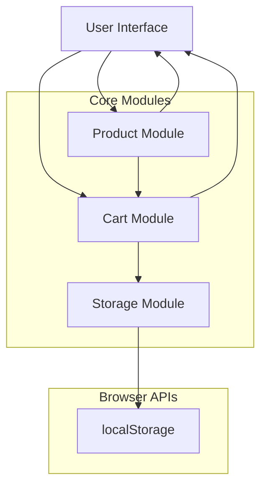
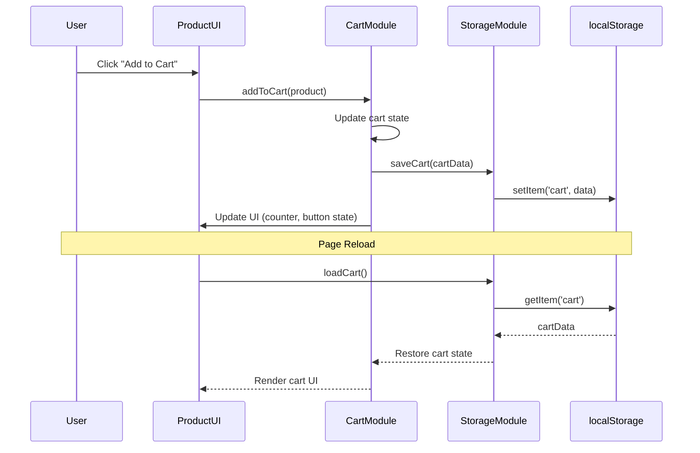

# Design Document

## Overview

The shopping cart system for Hami MiniMarket is a client-side JavaScript application that provides a seamless shopping experience with persistent storage. The system follows a modular architecture with three core modules: Product Module, Cart Module, and Storage Module. The design emphasizes separation of concerns, maintainability, and user experience across all device types.

### Key Design Principles

- **Modularity**: Clear separation between product rendering, cart logic, and storage operations
- **Persistence**: All cart data persists across browser sessions using localStorage
- **Responsiveness**: Optimized for mobile, tablet, and desktop experiences
- **Progressive Enhancement**: Core functionality works without JavaScript, enhanced features layer on top
- **Accessibility**: WCAG 2.1 AA compliant with keyboard navigation and screen reader support

## Architecture

### System Architecture Diagram



### Module Responsibilities

**Product Module (product.js)**
- Renders product displays with images, prices, and descriptions
- Handles "Add to Cart" button interactions
- Manages product data structure
- Communicates product selections to Cart Module

**Cart Module (cart.js)**
- Manages cart state and operations (add, remove, update quantity)
- Calculates subtotals, tax, discounts, and final totals
- Renders cart UI (sidebar/modal)
- Updates cart counter badge
- Triggers storage operations

**Storage Module (storage.js)**
- Abstracts localStorage interactions
- Handles serialization/deserialization of cart data
- Provides error handling for storage failures
- Implements fallback strategies when localStorage is unavailable

### Data Flow



## Components and Interfaces

### Product Module Interface

```javascript
// product.js

/**
 * Product data structure
 */
interface Product {
    id: number;
    name: string;
    category: string;
    price: number;
    description: string;
    image: string;
    badge: string;
}

/**
 * Public API
 */
const ProductModule = {
    // Render all products to the grid
    renderProducts(products: Product[]): void;
    
    // Render a single product card
    renderProductCard(product: Product): HTMLElement;
    
    // Handle add to cart button click
    handleAddToCart(productId: number): void;
    
    // Update button state after adding to cart
    updateButtonState(productId: number, isInCart: boolean): void;
    
    // Get product by ID
    getProduct(productId: number): Product | null;
};
```

### Cart Module Interface

```javascript
// cart.js

/**
 * Cart item structure
 */
interface CartItem {
    id: number;
    name: string;
    price: number;
    image: string;
    quantity: number;
}

/**
 * Cart summary structure
 */
interface CartSummary {
    subtotal: number;
    tax: number;
    discount: number;
    total: number;
    itemCount: number;
}

/**
 * Public API
 */
const CartModule = {
    // Add product to cart
    addToCart(product: Product): void;
    
    // Remove item from cart
    removeFromCart(productId: number): void;
    
    // Update item quantity
    updateQuantity(productId: number, quantity: number): void;
    
    // Get cart items
    getCartItems(): CartItem[];
    
    // Calculate cart summary
    calculateSummary(): CartSummary;
    
    // Clear entire cart
    clearCart(): void;
    
    // Check if product is in cart
    isInCart(productId: number): boolean;
    
    // Get total item count
    getItemCount(): number;
    
    // Render cart UI
    renderCart(): void;
    
    // Update cart counter badge
    updateCartCounter(): void;
    
    // Show/hide cart modal
    toggleCartModal(): void;
};
```

### Storage Module Interface

```javascript
// storage.js

/**
 * Storage configuration
 */
const STORAGE_KEY = 'hamiCart';
const STORAGE_VERSION = '1.0';

/**
 * Public API
 */
const StorageModule = {
    // Save cart to localStorage
    saveCart(cartItems: CartItem[]): boolean;
    
    // Load cart from localStorage
    loadCart(): CartItem[] | null;
    
    // Clear cart from localStorage
    clearCart(): boolean;
    
    // Check if localStorage is available
    isStorageAvailable(): boolean;
    
    // Get storage size
    getStorageSize(): number;
    
    // Handle storage errors
    handleStorageError(error: Error): void;
};
```

## Data Models

### Product Model

```javascript
class Product {
    constructor(data) {
        this.id = data.id;                    // Unique identifier
        this.name = data.name;                // Product name
        this.category = data.category;        // 'fruits' or 'vegetables'
        this.price = data.price;              // Price in dollars
        this.description = data.description;  // Product description
        this.image = data.image;              // Image path
        this.badge = data.badge;              // Badge text (e.g., 'Organic')
    }
    
    validate() {
        return this.id && this.name && this.price > 0;
    }
}
```

### CartItem Model

```javascript
class CartItem {
    constructor(product, quantity = 1) {
        this.id = product.id;
        this.name = product.name;
        this.price = product.price;
        this.image = product.image;
        this.quantity = quantity;
    }
    
    getLineTotal() {
        return this.price * this.quantity;
    }
    
    incrementQuantity() {
        this.quantity++;
    }
    
    decrementQuantity() {
        if (this.quantity > 1) {
            this.quantity--;
        }
    }
    
    setQuantity(newQuantity) {
        if (newQuantity > 0) {
            this.quantity = newQuantity;
        }
    }
}
```

### Cart Model

```javascript
class Cart {
    constructor() {
        this.items = [];
        this.taxRate = 0.05;           // 5% tax
        this.discountThreshold = 50;   // $50 minimum for discount
        this.discountRate = 0.10;      // 10% discount
    }
    
    addItem(product) {
        const existingItem = this.findItem(product.id);
        if (existingItem) {
            existingItem.incrementQuantity();
        } else {
            this.items.push(new CartItem(product));
        }
    }
    
    removeItem(productId) {
        this.items = this.items.filter(item => item.id !== productId);
    }
    
    updateQuantity(productId, quantity) {
        const item = this.findItem(productId);
        if (item) {
            item.setQuantity(quantity);
        }
    }
    
    findItem(productId) {
        return this.items.find(item => item.id === productId);
    }
    
    getSubtotal() {
        return this.items.reduce((sum, item) => sum + item.getLineTotal(), 0);
    }
    
    getDiscount() {
        const subtotal = this.getSubtotal();
        return subtotal >= this.discountThreshold 
            ? subtotal * this.discountRate 
            : 0;
    }
    
    getTax() {
        const subtotal = this.getSubtotal();
        const discount = this.getDiscount();
        return (subtotal - discount) * this.taxRate;
    }
    
    getTotal() {
        const subtotal = this.getSubtotal();
        const discount = this.getDiscount();
        const tax = this.getTax();
        return subtotal - discount + tax;
    }
    
    getItemCount() {
        return this.items.reduce((sum, item) => sum + item.quantity, 0);
    }
    
    clear() {
        this.items = [];
    }
    
    toJSON() {
        return {
            items: this.items,
            version: STORAGE_VERSION
        };
    }
    
    static fromJSON(data) {
        const cart = new Cart();
        if (data && data.items) {
            cart.items = data.items.map(item => 
                Object.assign(new CartItem({}, 0), item)
            );
        }
        return cart;
    }
}
```

## User Interface Design

### Cart Display Options

The design supports two UI patterns for cart display:

**Option 1: Sidebar (Recommended for Desktop)**
- Slides in from the right side
- Overlays content with backdrop
- Fixed width (400px)
- Scrollable content area

**Option 2: Modal (Recommended for Mobile)**
- Centers on screen
- Full-width on mobile
- Responsive width on desktop
- Scrollable content area

### Cart UI Components

```
Cart Container
├── Cart Header
│   ├── Title ("Shopping Cart")
│   └── Close Button
├── Cart Content
│   ├── Empty State (when cart is empty)
│   │   ├── Empty Icon
│   │   └── Empty Message
│   └── Cart Items List (when cart has items)
│       └── Cart Item (repeated)
│           ├── Product Image
│           ├── Product Details
│           │   ├── Product Name
│           │   └── Unit Price
│           └── Item Controls
│               ├── Quantity Controls
│               │   ├── Decrease Button
│               │   ├── Quantity Display
│               │   └── Increase Button
│               └── Remove Button
└── Cart Footer
    ├── Price Summary
    │   ├── Subtotal
    │   ├── Discount (if applicable)
    │   ├── Tax
    │   └── Total
    └── Action Buttons
        ├── Continue Shopping
        └── Checkout
```

### Order Summary Page

A dedicated page displaying:
- Complete list of cart items with quantities and prices
- Subtotal calculation
- Discount display (if applicable)
- Tax calculation (5%)
- Final total
- "Confirm Order" button

## Calculations and Business Logic

### Price Calculations

```javascript
// Calculation order (important for accuracy)
1. Calculate subtotal (sum of all line totals)
2. Calculate discount (if subtotal >= $50)
3. Calculate tax on discounted amount
4. Calculate final total

// Example:
Subtotal: $55.00
Discount (10%): -$5.50
Subtotal after discount: $49.50
Tax (5%): $2.48
Total: $51.98
```

### Tax Calculation

- Tax Rate: 5%
- Applied to: Subtotal minus discount
- Rounded to: 2 decimal places

### Discount Logic

```javascript
if (subtotal >= 50) {
    discount = subtotal * 0.10;  // 10% off
    displayDiscountBadge();
} else {
    discount = 0;
}
```

## Visual Feedback and Animations

### Toast Notifications

```javascript
// Toast notification structure
interface Toast {
    message: string;
    type: 'success' | 'error' | 'info';
    duration: number;  // milliseconds
}

// Example usage
showToast({
    message: 'Product added to cart',
    type: 'success',
    duration: 3000
});
```

**Toast Behavior:**
- Slide in from top-right
- Auto-dismiss after 3 seconds
- Stack multiple toasts vertically
- Dismiss on click

### Cart Update Animations

**Add to Cart:**
- Button scales up (1.1x) briefly
- Button text changes to "Added" with checkmark
- Cart counter animates (scale pulse)
- Optional: Product image flies to cart icon

**Remove from Cart:**
- Item fades out
- Remaining items slide up to fill space
- Cart counter updates with animation

**Quantity Change:**
- Number briefly scales up
- Totals update with smooth transition

### Loading States

- Skeleton screens for initial product load
- Spinner for cart operations
- Disabled state for buttons during operations

## Error Handling

### localStorage Errors

```javascript
// Error scenarios and handling

1. localStorage not available (private browsing)
   - Fallback: Use in-memory storage
   - Warning: Display message about session-only cart

2. localStorage quota exceeded
   - Clear old data
   - Notify user
   - Fallback to in-memory storage

3. Data corruption
   - Clear corrupted data
   - Start with empty cart
   - Log error for debugging

4. JSON parse errors
   - Clear invalid data
   - Start with empty cart
   - Log error for debugging
```

### User-Facing Error Messages

```javascript
const ERROR_MESSAGES = {
    STORAGE_UNAVAILABLE: 'Cart will only persist during this session',
    STORAGE_FULL: 'Unable to save cart. Please try removing some items.',
    LOAD_FAILED: 'Unable to load saved cart. Starting fresh.',
    NETWORK_ERROR: 'Unable to load products. Please refresh the page.',
    INVALID_QUANTITY: 'Please enter a valid quantity',
};
```

### Error Recovery Strategies

1. **Graceful Degradation**: Core functionality works without localStorage
2. **User Notification**: Clear, actionable error messages
3. **Automatic Retry**: Retry failed operations once
4. **Fallback Storage**: Use sessionStorage if localStorage fails
5. **Error Logging**: Console logging for debugging

## Testing Strategy

### Unit Testing

**Product Module Tests:**
- Product rendering with valid data
- Product rendering with missing data
- Add to cart button interaction
- Button state updates

**Cart Module Tests:**
- Add item to empty cart
- Add duplicate item (quantity increment)
- Remove item from cart
- Update item quantity
- Calculate subtotal correctly
- Calculate tax correctly
- Calculate discount correctly
- Calculate total correctly
- Clear cart

**Storage Module Tests:**
- Save cart to localStorage
- Load cart from localStorage
- Handle localStorage unavailable
- Handle corrupted data
- Handle quota exceeded

### Integration Testing

- Add product → Save to storage → Reload page → Verify cart restored
- Add multiple products → Calculate totals → Verify accuracy
- Apply discount → Calculate tax → Verify correct order of operations
- Fill cart → Clear cart → Verify storage cleared

### User Acceptance Testing

- Browse products and add to cart
- View cart and verify items
- Update quantities and verify totals
- Remove items and verify updates
- Close browser and reopen → Verify cart persisted
- Complete checkout flow
- Test on mobile, tablet, and desktop
- Test with screen reader
- Test keyboard navigation

### Performance Testing

- Load time for product catalog
- Cart update responsiveness
- localStorage read/write performance
- Animation smoothness
- Memory usage over time

## Accessibility Considerations

### Keyboard Navigation

- Tab through all interactive elements
- Enter/Space to activate buttons
- Escape to close modals
- Arrow keys for quantity adjustment

### Screen Reader Support

- Proper ARIA labels on all controls
- Live regions for cart updates
- Descriptive button labels
- Form labels properly associated

### Visual Accessibility

- Sufficient color contrast (WCAG AA)
- Focus indicators on all interactive elements
- Text alternatives for icons
- Responsive text sizing

## Browser Compatibility

### Minimum Requirements

- Chrome 90+
- Firefox 88+
- Safari 14+
- Edge 90+

### Feature Detection

```javascript
// Check for required features
const hasLocalStorage = 'localStorage' in window;
const hasIntersectionObserver = 'IntersectionObserver' in window;
const hasVibrate = 'vibrate' in navigator;

// Provide fallbacks for missing features
if (!hasIntersectionObserver) {
    // Use scroll event fallback
}
```

## Performance Optimizations

### Code Splitting

- Load cart module only when needed
- Lazy load product images
- Defer non-critical JavaScript

### Caching Strategy

- Cache product data in memory
- Debounce cart updates to storage
- Throttle scroll event handlers

### Bundle Size

- Minimize JavaScript bundle
- Remove unused code
- Use native browser APIs where possible

## Security Considerations

### Data Validation

- Validate all user inputs
- Sanitize data before storage
- Validate data loaded from storage

### XSS Prevention

- Escape HTML in user-generated content
- Use textContent instead of innerHTML where possible
- Sanitize product data

### Privacy

- No sensitive data in localStorage
- Clear cart data on logout (if auth added)
- Respect Do Not Track preferences

## Future Enhancements

### Phase 2 Features

- User accounts and server-side cart sync
- Product favorites/wishlist
- Cart sharing via URL
- Recently viewed products
- Product recommendations

### Phase 3 Features

- Multiple payment methods
- Order history
- Inventory management
- Real-time stock updates
- Advanced search and filtering
